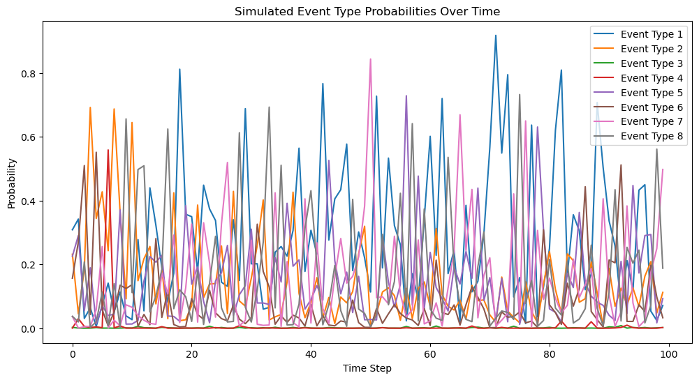
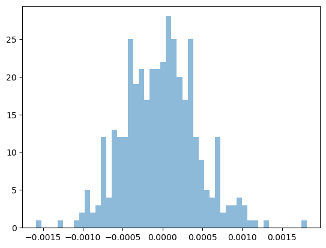

# Simulation Group Work - Process Diagram & Notes

Context

The simulation group work on simulating a financial market based on statistical and machine learning model. Our objective was to provide a close representation of the difference order types occurence within a trading session.
To build such an algorithm 3 main tasks have to be achieved:

1. Preparing the historic data that will be used as the kernel of the algorithm
2. Sampling the price, the volume and the occurence of each order types per time (ms)
3. Orchestrate everything (the core of the algorithm)
Folder Structure


The sim folder is structured as follows:
```txt
sim/
│
├── data/
│   ├── logs/
|   |   └──  simulation_results.csv --File used for logging pruposes
|   ├── LOBSTER_SampleFiles_ReadMe.txt
|   ├── message_data.csv
|   ├── orderbook_data.csv
| 
├── src
│   ├── _pycache_/
│   ├── _init_.py
│   ├── market_sim2_xgb.py  --Simulaton Algorithm File
|   ├── model_research.ipynb --Notebook use for research purposes
|   ├── xgboost_model.pkl --Pickle file for the XGBoostClassifier Model
│   ├── static/
|   |
│   │
│   └── depreciated/  
│       ├── market_sim.py
|       ├── market:sim2_xgb_depreciated_wei.py -- Model using weibull distirbution for price
|       ├── market_sim2.py -- Algorithm using Poisson Distribution for Order types
|       ├── hawkes_data.csv

└── requirements.txt  --Libraries required to install prior to 
```

## How-To

* Step 1: Clone the repo and install the different python libraries
```git clone github_repo_path
pip install -r requirements
```

* Step 2: To start the simulation use SimulationRunner Class which takes for parameteres the log_folder_name (storing logs) and num_simulation (# of simulations)
```python
# Insantiate a folder path for storing the logs
log_folder_path = 'sim/data/logs/simulation_results.csv'
```
```python
# Define number of Simulation liked
num_simulations = 5
```
```python
# Instantiate the SimulationRunner Class
sim_runner = Simulation(log_folder_path, num_simulations)

# Run the Simulation(s)
simulation_runner.run_simulations()
```
## Technical Details

__Sampling Methods__

Two different sampling methods were used to build the algorithm (direct sampling from a distribution for price and volume, and machine learning supervised classification technique using XGBoost for order types).

_Order Types_

The challenge of simulation Order Types is that we have to be able to capture some auto-correlations between each point observations. We first started by simulating with a simple Poisson Distribution, the problem is that Poisson assumes independency within each observations and variables, eventho it works it didn't tend to reflect reality.

To move from distribution, we try to use a Multivariate Hawkes Process using the HawkesLib python Open Source library, however this library has not be updated since 2018 and didn't fit the volume of our dataset (~400k rows).
We arrived at the conclusion that we should try to use a machine learning algorithm that we could use as time series forecasting, in order to predict the probability of each event/order types happening per timestamps.
In order to supervised this time-series classification problem, we created a target variable that represent each next-row order type. 
Example:
```
|Index  |event_type |target
|1      |     8     |   1
|2      |     1     |   2
|3      |     2     |  ...
```
We therefore created some additional lag features in ordeer to capture the maximum autocorrelations between each observations. The goal here wasn't to reach precision but mainly to cpature internal patterns.
```python
for lag in range(1, 4): # We assumes going up to 4 lags was enough
    df[f'Time_lag{lag}'] = df['Time'].shift(lag) # Tim Lag
    df[f'Size_lag{lag}'] = df['Size'].shift(lag) # Size (Volume) Lag
    df[f'Price_lag{lag}'] = df['Price'].shift(lag) # Price Lag
    df[f'mid_price_lag{lag}'] = df['mid_price'].shift(lag) # Mid Price
    df[f'calc_direction_lag{lag}'] = df['calc_direction'].shift(lag) # Direction lag
```



In order to save and re-use the model in our Simulation Algorithm we use the python library called pickl.

## Price

In order to simulate the price, we use a direct sampling method with a Gaussian Distribution on the mid-price return, resampled to a 1min interval and use a Open-High-Low-Close (OHLC) technique. We estimated the parameters (mean and standard deviation using the maximum likelyhood). We tried a weibull distribution approach but didn't reacted as expected.
When plotting the empirical distribution of the return of our mid price we can see that a normal curve can be more or less extrapollated.



This sampling technique enables us to create the new price with the following formula.
$$
P_1 = P_0 \times (1 + R)
$$

where:
* 𝑃1 is the new price
* 𝑃0 is the old price
* 𝑅 is the return
In addition, the sampling process happens twice for the price because of the bi-directionality (sell and buy).

## Volume
For the Volume, we use the same approach as the Price, but instead of a Gaussian distribution, we use a Gamma distribution which is left skew (as the frequency of small order are higher than big ones). In order to fit the parameters according to our empirical data we use the scipystats .fit()method.
We sample the volume for each of the different event_types:
* Buy Limit Order
* Sell Limit Order
* Buy Market Order
* Sell Market Order
Market_sim2_xgb.py Structure

The market_sim2_xgb.py structure is composed by two classes:
* MarketSim()
* SimulationRunner()

The Marketsim class execute the following flow:

Data Preprocessing → XGBoost Classifier Order Sim. → Price Sim. → Volume Sim. → Algo simulation → run_market_simulation (Orchestration)

The SimulationRunner() class helps the user to set some highlevel parameters (log_file + number of simulation)

Algo Simulation Kernel

This Algorithm iterates through the probability of orders occuring simulated by our machine learning model for every timestamp, it checked the probability threshold. If > 0.5 occuring and then for each event type (except for delete and update order type) choose "randomly" through their respective price and volume distirbution.
```python 
 for index, row in probabilities_df.iterrows():
            for col in probabilities_df.columns:
                if row[col] > 0.5:  # Check if the probability is greater than 0.5
                    # Extract numeric part from column name
                    order_type = int(col.split('_')[-1])
                    if order_type == 1:
                        # Buy Limit
                        return_price = random.choice(sim_returns_buy_wei)
                        price = start_price * (1 + return_price)
                        volume = random.choice(sim_vol_buy_lim_gam)
                        results.append(
                            {'Time': index, 'OrderType': 1, 'Price': price, 'Volume': volume})
                        start_price = price

                    elif order_type == 2:
                        # Sell Limit
                        return_price = random.choice(sim_returns_sell_wei)
                        price = start_price * (1 + return_price)
                        volume = random.choice(sim_vol_sell_lim_gam)
                        results.append(
                            {'Time': index, 'OrderType': 2, 'Price': price, 'Volume': volume})
                        start_price = price

                    elif order_type == 7:
                        # Buy Market
                        return_price = random.choice(sim_returns_buy_wei)
                        price = start_price * (1 + return_price)
                        volume = random.choice(sim_vol_buy_mrkt_gam)
                        results.append(
                            {'Time': index, 'OrderType': 7, 'Price': price, 'Volume': volume})
                        start_price = price

                    elif order_type == 8:
                        # Sell Market
                        return_price = random.choice(sim_returns_sell_wei)
                        price = start_price * (1 + return_price)
                        volume = random.choice(sim_vol_sell_mrkt_gam)
                        results.append(
                            {'Time': index, 'OrderType': 8, 'Price': price, 'Volume': volume})

                        # Update the starting price for the next iteration based on the last transaction
                        start_price = price

        return results
```
## Further Improvements

* already implement a default file log
* when run, the output should be a pandas dataframe

